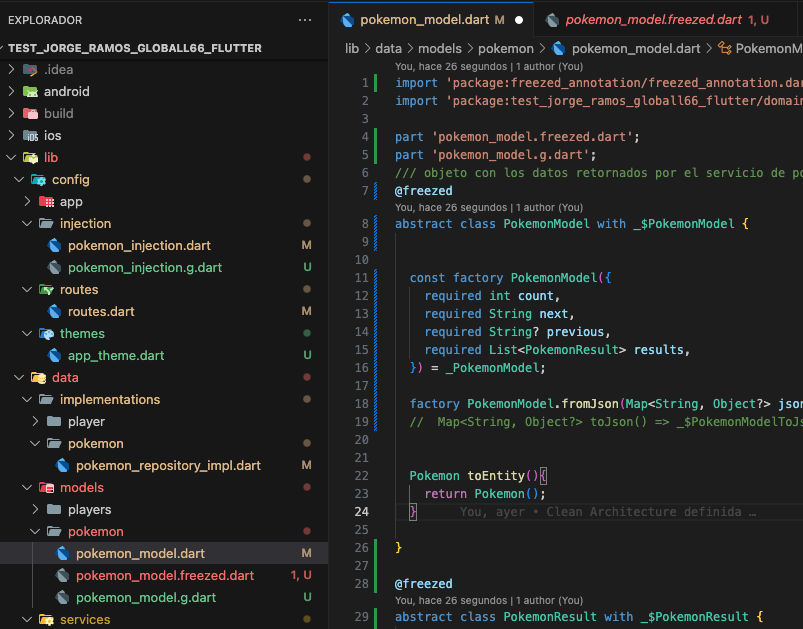
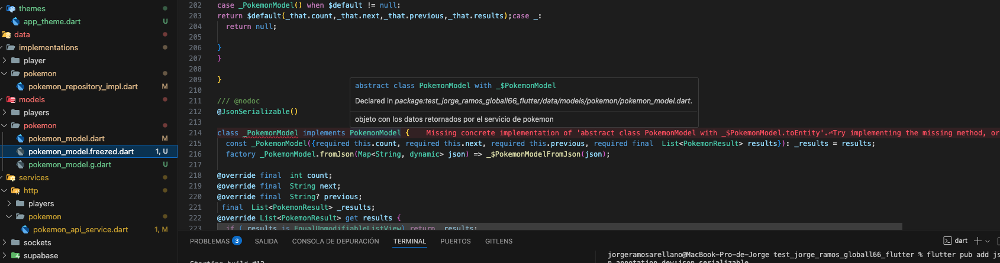

# Flutter Test - Jorge Ramos Arellano - Global66

# Resumen

Para este test, se utilizó, arquitectura limpia, con principios CLEAN CODE,SOLID, KISS, DRY...

Como manejador de estados he implementado la última versión de Riverpod (v3.0.x), con code generetor del mismo, recomendado por los creadores del package.

La estructura y encarpetado del proyecto está basado en Clean Architecture, con sus capas fuertemente acopladas al principio de separación de responsabilidades.

> Riverpod Code Generator

> Cliente HTTP: Dio

> Flutter 3.35.7 - Dart 3.9.2 

# Clean Architecture

- Capa de configuración [/config]
    Se utiliza para la configuración, injección de dependencias, routes, seteo de data global para el launcher del app.

- Capa de data [/data]
    Donde están los endpoints para consumir los servicios, donde se guardan los manejadores de estado, preferences..

- Capa de dominio [/domain]
    Creación de entidades(models), gateway() y usecase(casos de uso)

- Capa visual [/presentation]
    Vistas, controladores de las vistas, lógicas de negocio en los providers,pantallas, widgets y todo lo que se pinta en la pantalla.

# Limitaciones 

- El paquete **Freezed** ha sido descartado para este proyecto por los siguientes motivos:

    - Intentando seguir los principios del clean_architecture, al momento de crear un Entity en base a un Model, el paquete me no permite crear una función para esta funcionalidad.

    - 

    - 

    - Genera mucho boilerplate. En su lugar, recomiendo usar la extensión **Dart Data Class Generator**, más sencillo y con el mismo objetivo sin perder los fundamentos del lenguaje y reforzando los mismos.

- La UI presentada en el Figma no corresponde con los datos que retorna la lista de los Pokemones (https://pokeapi.co/api/v2/pokemon), como tampoco los detalles de cada Pokemon (https://pokeapi.co/api/v2/pokemon/ ́${name} ́). 
En caso de yo estar equivocado, dejármelo saber. Agradezco el feedback.

- Filtros no creados por limitaciones del API y tiempos de la prueba.

> Arellano
